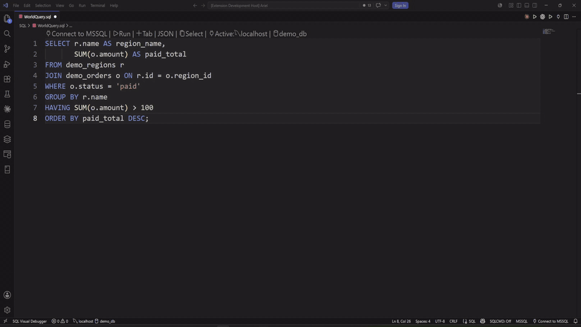
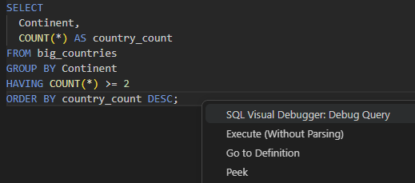
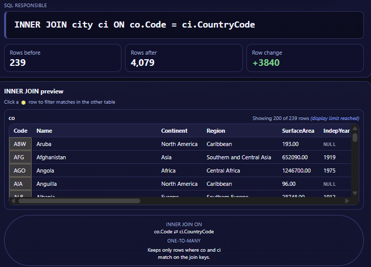
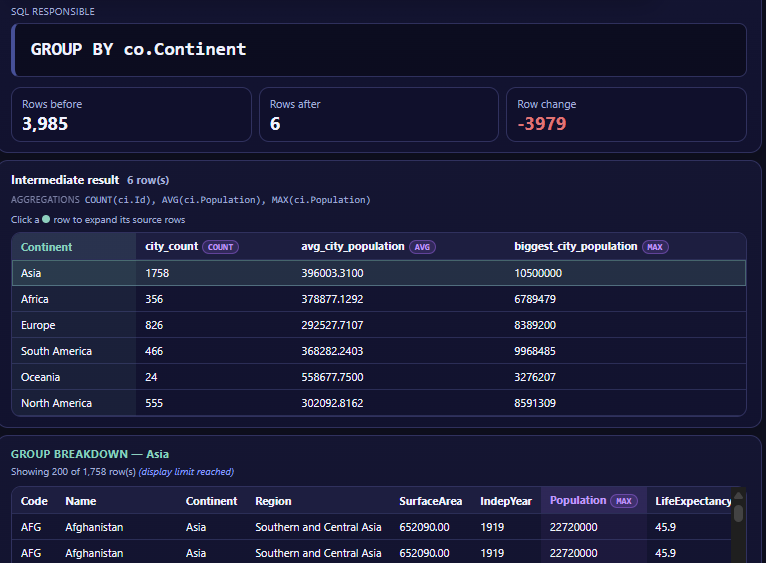
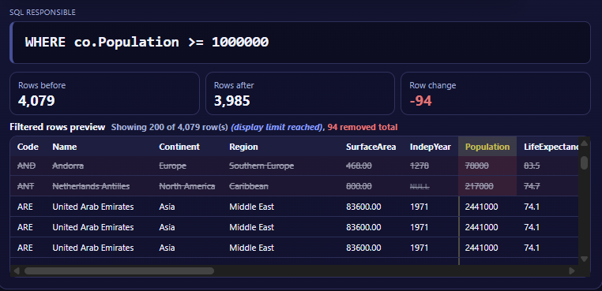

# SQL Visual Debugger Marketplace Preview

This repository is used to preview the SQL Visual Debugger marketplace page and collect feedback.

## Short Description

Visually debug SQL SELECT queries clause by clause in VS Code for MySQL, PostgreSQL, SQL Server, and SQLite.

---

# SQL Visual Debugger

Debug SQL visually, clause by clause.

See how rows change after `FROM`, `JOIN`, `WHERE`, `GROUP BY`, `HAVING`, `SELECT`, `DISTINCT`, `ORDER BY`, and `LIMIT` inside VS Code.

No database ready? Open the demo playground and try it instantly.



## Try it in 30 seconds

1. Open the Command Palette.
2. Run `SQL Visual Debugger: Open Demo Playground`.
3. A sample SQL file opens and the first query runs automatically.
4. Click `Next` and `Previous` to see what each SQL clause did.
5. Select another query in the playground file, right-click it, and choose `SQL Visual Debugger: Debug Query`.

The demo playground uses sample SQLite data, so you can see the debugger before configuring your own database.

## Use it on your own SQL

1. Open a `.sql` file in VS Code.
2. Select one supported `SELECT` query, or place your cursor inside the query.
3. Right-click and choose `SQL Visual Debugger: Debug Query`.
4. If prompted, choose your database type and enter the connection details.
5. Step through the result as each SQL clause changes the rows.

You can also run `SQL Visual Debugger: Connect to Database` first if you want to save a local connection before debugging.



## What you can see

### JOIN preview

See both sides of the join, the join condition, row-count changes, and the joined result. Click join-key rows to inspect how matches were produced.



### GROUP BY breakdown

Inspect the grouped output and the source rows that contributed to each group.



### WHERE before and after

See which rows survived filtering and which rows were removed.



## Supported databases

- MySQL
- PostgreSQL
- SQL Server
- SQLite

Connections are local-only. SQLite uses an absolute path to a local `.db` or `.sqlite` file.

## Safety

SQL Visual Debugger is built for read-only debugging.

- Runs supported read-only `SELECT` and `WITH` query shapes
- Blocks non-read-only SQL before execution
- Blocks unsupported query shapes instead of guessing
- Uses local database connections only
- Keeps passwords only in session memory
- Clears cached passwords after access-denied failures so the next attempt prompts again

This is not a general-purpose SQL runner. It is a focused visual debugger for supported SQL query analysis.

## Supported query shapes

SQL Visual Debugger currently supports local debugging flows for MySQL, PostgreSQL, SQL Server, and SQLite built around:

- read-only `SELECT` queries
- supported non-recursive `WITH` queries
- `FROM`
- `JOIN`
- `WHERE`
- `GROUP BY`
- `HAVING`
- `SELECT`
- `DISTINCT`
- `ORDER BY`
- `LIMIT` / supported `TOP`-style limiting
- simple `FROM (...) alias` subqueries
- supported `WHERE IN (...)` subqueries
- supported scalar subqueries in `WHERE`
- supported `CASE` expressions
- supported window functions in `SELECT`
- simple uncorrelated aggregate scalar subqueries in the `SELECT` list

## Current boundaries

When a query is outside the supported visual-debugging shape, the extension stops with a clear message instead of pretending to debug it.

Currently unsupported or limited areas include:

- non-`SELECT` statements such as `INSERT`, `UPDATE`, `DELETE`, `DROP`, and `ALTER`
- `UNION`
- recursive CTEs
- remote database hosts
- non-equality join conditions
- `CROSS JOIN`, `NATURAL JOIN`, and `FULL OUTER JOIN`
- many advanced subquery shapes
- correlated scalar subqueries in the `SELECT` list
- grouped scalar subqueries in the `SELECT` list
- some advanced window-function syntax
- SQL Server `TOP` with `GROUP BY` is a known debugger limitation

PostgreSQL note: if your tables are inside a schema other than `public`, use schema-qualified names such as `schema_name.orders`.

SQLite note: SQLite connections use a local absolute file path. Network shares and relative paths are intentionally rejected.

## Telemetry and privacy

SQL Visual Debugger collects anonymous product telemetry to improve reliability and prioritize future support.

Telemetry may include:

- extension version
- anonymous install ID
- debugger command usage
- successful, failed, rejected, and unsupported debug attempts
- safe query-shape flags such as `has_join`, `has_group_by`, `has_distinct`, or `has_window_function`
- query length bucket, such as `100-499` characters
- interactions with visual explanation features, such as opening DISTINCT details or clicking JOIN rows
- safe error categories, such as `unsupported_syntax` or a database error code

Telemetry never includes:

- SQL query text
- table, column, schema, or database names
- database credentials
- database hostnames or IP addresses
- query result data
- file paths
- location fields such as city, country, latitude, or longitude

Telemetry respects VS Code's global telemetry setting and can also be disabled from the Command Palette with:

```text
SQL Visual Debugger: Disable Telemetry
```

Or by setting:

```json
"sqlVisualDebugger.telemetry.enabled": false
```
